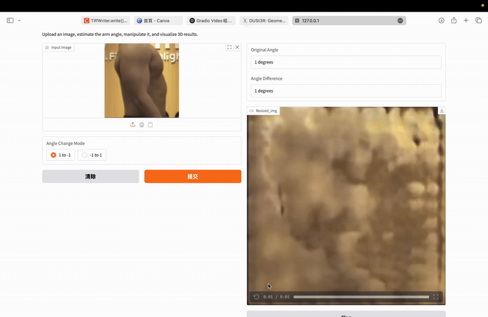

## Get Started

### Installation

1. Clone DUSt3R.
```bash
git clone --recursive https://github.com/naver/dust3r
cd dust3r
# if you have already cloned dust3r:
# git submodule update --init --recursive
```

2. Create the environment, here we show an example using conda.
```bash
conda create -n dust3r python=3.11 cmake=3.14.0
conda activate dust3r 
conda install pytorch torchvision pytorch-cuda=12.1 -c pytorch -c nvidia  # use the correct version of cuda for your system
pip install -r requirements.txt
# Optional: you can also install additional packages to:
# - add support for HEIC images
# - add pyrender, used to render depthmap in some datasets preprocessing
# - add required packages for visloc.py
pip install -r requirements_optional.txt
```

3. Optional, compile the cuda kernels for RoPE (as in CroCo v2).
```bash
# DUST3R relies on RoPE positional embeddings for which you can compile some cuda kernels for faster runtime.
cd croco/models/curope/
python setup.py build_ext --inplace
cd ../../../
```

### Checkpoints

You can obtain the checkpoints by two ways:

1) You can use our huggingface_hub integration: the models will be downloaded automatically.

2) Otherwise, We provide several pre-trained models:

| Modelname   | Training resolutions | Head | Encoder | Decoder |
|-------------|----------------------|------|---------|---------|
| [`DUSt3R_ViTLarge_BaseDecoder_224_linear.pth`](https://download.europe.naverlabs.com/ComputerVision/DUSt3R/DUSt3R_ViTLarge_BaseDecoder_224_linear.pth) | 224x224 | Linear | ViT-L | ViT-B |

To download a specific model, for example `DUSt3R_ViTLarge_BaseDecoder_224_linear.pth`:
```bash
mkdir -p checkpoints/
wget https://download.europe.naverlabs.com/ComputerVision/DUSt3R/DUSt3R_ViTLarge_BaseDecoder_224_linear.pth -P checkpoints/
```

### DataPreprocessing
To prepare your dataset for training the DUSt3R model, follow these steps using the provided preprocessing scripts:
```bash
# Step 1: Convert .mp4 video files into resized .png image frames.
# Make sure to update the file path to point to your own video folder.
python slice.py

# Step 2: Generate binary human body masks (1 for foreground, 0 for background).
# Update the folder path to your dataset directory.
python gen_mask.py

# Step 3: Perform elbow tracking and generate a .json file with the keypoints.
# Again, ensure the folder path matches your data location.
python gen_albow.py

```
After completing these steps, you will have all the necessary data ready for training the DUSt3R model.


## Training

In this section, we present a short demonstration to get started with training DUSt3R.

```bash
# step 1 - train dust3r for 224 resolution
torchrun --nproc_per_node=4 train.py \
    --train_dataset "1000 @ Co3d(split='train', ROOT='data/co3d_subset_processed', aug_crop=16, mask_bg='rand', resolution=224, transform=ColorJitter)" \
    --test_dataset "100 @ Co3d(split='test', ROOT='data/co3d_subset_processed', resolution=224, seed=777)" \
    --model "AsymmetricCroCo3DStereo(pos_embed='RoPE100', img_size=(224, 224), head_type='linear', output_mode='pts3d', depth_mode=('exp', -inf, inf), conf_mode=('exp', 1, inf), enc_embed_dim=1024, enc_depth=24, enc_num_heads=16, dec_embed_dim=768, dec_depth=12, dec_num_heads=12)" \
    --train_criterion "ConfLoss(Regr3D(L21, norm_mode='avg_dis'), alpha=0.2)" \
    --test_criterion "Regr3D_ScaleShiftInv(L21, gt_scale=True)" \
    --pretrained "checkpoints/CroCo_V2_ViTLarge_BaseDecoder.pth" \
    --lr 0.0001 --min_lr 1e-06 --warmup_epochs 1 --epochs 10 --batch_size 16 --accum_iter 1 \
    --save_freq 1 --keep_freq 5 --eval_freq 1 \
    --output_dir "checkpoints/dust3r_demo_224"	  
```

### Our Hyperparameters

Here are the commands we used for training the models:

```bash
# NOTE: ROOT path omitted for datasets
# 224 linear
CUDA_VISIBLE_DEVICES=0 \
torchrun --nproc_per_node=1 --rdzv_backend=c10d --rdzv_endpoint=localhost:29500 --standalone train.py \
    --train_dataset "ArmDataset(split='train', ROOT='/home/jerry-tseng/2025spring/ev/fp/data', resolution=224)" \
    --test_dataset "ArmDataset(split='test', ROOT='/home/jerry-tseng/2025spring/ev/fp/data', resolution=224)" \
    --model "AsymmetricCroCo3DStereo(pos_embed='RoPE100', img_size=(224, 224), head_type='linear', output_mode='pts3d', depth_mode=('exp', -inf, inf), conf_mode=('exp', 1, inf), enc_embed_dim=1024, enc_depth=24, enc_num_heads=16, dec_embed_dim=768, dec_depth=12, dec_num_heads=12)" \
    --train_criterion "Regr3D(L21, norm_mode='avg_dis')" \
    --test_criterion "Regr3D(L21, norm_mode='avg_dis')" \
    --pretrained "/home/jerry-tseng/robinlab/delta/VisionProject/code_for_github/xrai_dust3r/checkpoints/DUSt3R_ViTLarge_BaseDecoder_224_linear.pth" \
--lr=0.0001 --min_lr=1e-06 --warmup_epochs=20 --epochs=500 --batch_size=4 --accum_iter=2 \
    --save_freq=10 --keep_freq=50 --eval_freq=1 --print_freq=10 \
    --output_dir "/home/jerry-tseng/robinlab/delta/VisionProject/code_for_github/xrai_dust3r/checkpoints"
```
## Running the Demo
After preprocessing and training, you can generate a demo session using:

```bash
# Run the arm_demo script to visualize the model output.
# Remember to update the model path in the script or command.
python arm_demo.py

```
This script takes a single initial image frame as input and produces a .mp4 video that shows the predicted motion sequence.

### Example Output
Here’s an example of the demo result:


But it fail :(